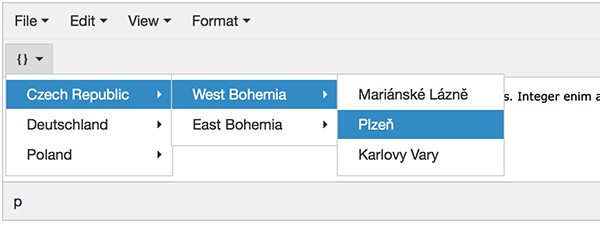

# TinyMCE 4.x Snippet plugin
Plugin create simple multi level dropdown menu for inserting custom HTML code or plain text into your text.

This plugin supports ***TinyMCE 4.x***.

Older versions of the plugin for **TinyMCE 3.x**: https://github.com/eduardstula/tinymce-simple-snippet.

## Screenshot
dropdown **multilevel menu**



## Install
* Copy plugin folder **src/tinymce/plugings/snippet** to your TinyMCE plugin folder (etc. tinymce/plugins/).

## Configuration
- Add `snippet` to param *plugins*
- Insert the `snippet` button to toolbar
- Define param `snippet_list`
```
var snippet_data = [];

tinymce.init({
    selector: 'textarea',
    plugins: 'snippet',
    toolbar: 'snippet',
    snippet_list: snippet_data
});
```
## Data


You must define data source `snippet_data`. Source must be defined before `tinyMCE.init` definition.
* `title` = menu item title
* `value` = HTML or plain text that will be inserted
* `items` = submenu = array of menu items

```
var snippet_data = [
{
    title: "Czech Republic",
    value: "",
    items: [
        {
            title: "West Bohemia",
            value: "",
            items: [
                {
                    title: "Mariánské Lázně",
                    value: "City: Mariánské Lázně"
                },
                {
                    title: "Plzeň",
                    value: "City: Plzeň"
                },
                {
                    title: "Karlovy Vary",
                    value: "City: Karlovy Vary"
                }
            ]
        }]
}
];
```
## Events


You can use the callback function:

* `onSelect` = callback function when selecting

```
var snippet_data = [
{
    title: "Cities",
    value: "",
    items: [
        {
            title: "Pilsen",
            value: "49.746955, 13.377288",
            onSelect: function (item) {
            
                //menu item name => Pilsen
                console.log(item.title);
                
                //menu item value => 49.746955, 13.377288
                console.log(item.value);
            }
        }]
}
];
```
